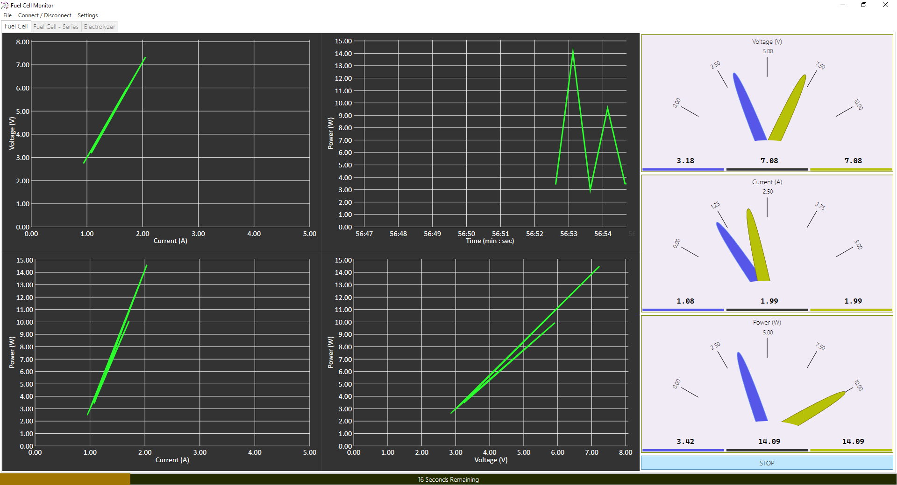

# Fuel Cell Monitor

FCM allows communicating with hardware to gather analog to digitally converted values at different measurement points on fuel cells or electrolyzers and presents the gathered data through gauges, bars and charts in real-time.

## Features

  - MODBUS communication over COM port
  - Applying *Mx+C* equation to each data value for scaling and offsetting
  - Selectable communication periodicity
  - Selectable time for experiment
  - Export experiment data to *CSV* file
  - Voltage, Current and Power gauges with instantaneous, maximum and maximum power point display
  - Plotting PV, IV, PI charts in real-time

